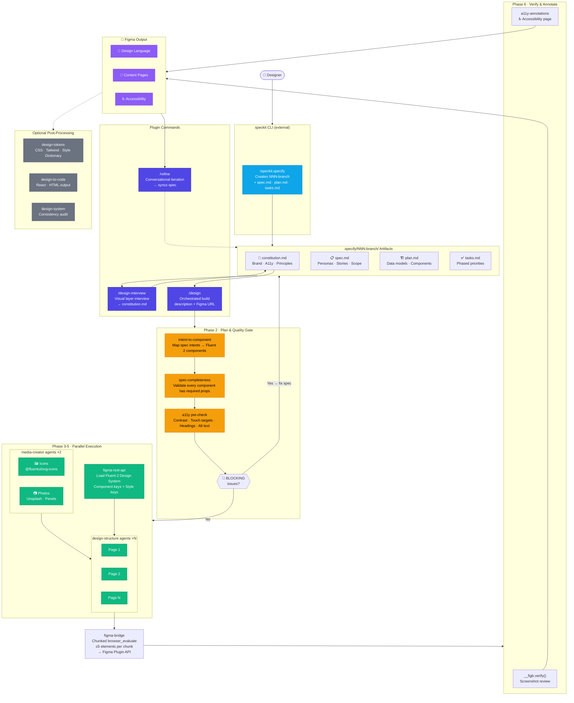

# ak-marketplace

A marketplace for Claude Code plugins by Anna Kellerstein.

## Plugins

| Plugin | Description |
|--------|-------------|
| [figma-plugin](#figma-plugin) | Orchestrated, spec-driven design automation for Figma |

---

## figma-plugin

Design and Figma integration for Claude Code. Automates Figma via the Plugin API with parallel agents, Fluent 2 Design System integration, and built-in accessibility validation.

**Version:** 2.4.0

### What it does

1. `/speckit.specify "..."` — real speckit CLI creates a feature branch + functional spec
2. `/design-interview` — interviews you for the design layer (brand, mood, a11y) → writes `constitution.md`
3. `/design` — reads the full spec, validates it, then builds your design in Figma using parallel agents
4. `/refine "..."` — conversational post-build iteration → syncs every change back to spec

The orchestrator never touches Figma directly. It delegates all asset gathering to `media-creator` agents and all Figma building to `design-structure` agents running in parallel.

### Workflow



---

## Quick setup

```bash
git clone https://github.com/annkellerstein/ak-marketplace
cd ak-marketplace
bash setup.sh
```

The script handles everything: checks Python 3.11+ and `uv`, installs speckit, saves your Figma token to Claude Code settings, configures the Playwright MCP server, and clones the Figma Bridge Chrome extension. The only manual step is loading the extension in Chrome — the script opens the page for you.

Restart Claude Code after the script finishes, then jump to [Usage](#usage).

---

## Prerequisites (manual alternative)

### 1. Figma account

You need a Figma account with **edit access** to the file you want to design in.

### 2. Figma personal access token

Used by the `figma-rest-api` skill to read the Fluent 2 Design System.

1. In Figma, go to **Account Settings → Personal access tokens → Generate new token**
2. Set it as an environment variable:

```bash
export FIGMA_ACCESS_TOKEN=your_token_here
```

Or add it to your Claude Code settings:

```json
{
  "env": {
    "FIGMA_ACCESS_TOKEN": "your_token_here"
  }
}
```

### 3. Figma Bridge Chrome extension

The plugin drives Figma via its Plugin API through a Chrome extension that injects `__figb` (helper library) and `__figs` (status panel) into every Figma page.

```bash
git clone https://github.com/lukaskellerstein/figma-bridge
```

Then in Chrome:
1. Navigate to `chrome://extensions`
2. Enable **Developer mode**
3. Click **Load unpacked** and select the cloned folder

### 4. Playwright MCP server

The plugin uses Playwright to automate the browser (Figma tab).

Install globally, then configure in your Claude Code settings:

```bash
npm install -g @playwright/mcp@0.0.68
```

```json
{
  "mcpServers": {
    "design-playwright": {
      "command": "playwright-mcp",
      "args": ["--extension"]
    }
  }
}
```

### 5. speckit CLI

Required before running `/design`. Creates feature branches and functional spec artifacts.

```bash
uvx --from git+https://github.com/github/spec-kit.git specify init .
```

---

## Installation

### Install the plugin

Clone this repo and install the `figma-plugin` into Claude Code:

```bash
git clone https://github.com/annkellerstein/ak-marketplace
cd ak-marketplace
```

In Claude Code, add the plugin from the local path:

```json
{
  "plugins": [
    {
      "source": "/path/to/ak-marketplace/plugins/figma-plugin"
    }
  ]
}
```

Or install directly via Claude Code if the marketplace is configured:

```
/plugins install figma-plugin
```

---

## Usage

### Step 1: Create a spec with speckit

Run the speckit commands to define what you're building. Each feature gets its own branch and `.specify/NNN-branch/` folder.

```bash
/speckit.specify "A task management app for remote teams"
/speckit.plan "React + TypeScript, Tailwind CSS"
/speckit.tasks
```

This creates a numbered branch (e.g., `001-task-management`) with `spec.md`, `plan.md`, and `tasks.md` inside `.specify/001-task-management/`.

### Step 2: Add the design layer with `/design-interview`

```
/design-interview
```

Asks ~25 questions about visual mood, brand color, component intent, and accessibility. Reads your existing spec first and skips anything already answered. Writes `constitution.md` into the active branch's spec folder.

Use `--quick` for ~8 questions or `--exhaustive` for ~50.

> `constitution.md` is optional — if you skip this step, `/design` proceeds with Fluent 2 defaults.

### Step 3: Open your Figma file in Chrome

Open the Figma file you want to design in. Make sure you have edit access. Open any plugin once (Menu → Plugins → any plugin) and close it — this is required for the `figma` global to be available.

### Step 4: Run `/design`

```
/design A task management dashboard https://www.figma.com/design/ABC123/MyFile
```

The orchestrator will:

1. Detect the current branch and read all spec artifacts from `.specify/NNN-branch/`
2. Build a design plan grounded in the spec
3. Run spec completeness + accessibility pre-checks (blocks on any BLOCKING issue)
4. Spawn media agents (icons + photos) in parallel
5. Load Fluent 2 Design System component and style keys
6. Spawn design-structure agents (one per page) in parallel
7. Verify the built design + add an accessibility annotation page

### Step 5: Iterate with `/refine`

```
/refine "make the header smaller" https://www.figma.com/design/ABC123/MyFile
/refine "change the button color to coral" https://www.figma.com/design/ABC123/MyFile
```

Each change is applied surgically in Figma, then synced back to the relevant spec file in `.specify/NNN-branch/`. Before/after screenshots confirm the result.

### Optional post-processing

After the design is built, use individual skills for follow-up tasks:

| Task | Skill |
|------|-------|
| Export design tokens | `design-tokens` skill |
| Generate React/HTML code | `design-to-code` skill |
| Audit design consistency | `design-system` skill |

---

## Components

### Commands

| Command | Description |
|---------|-------------|
| `/design-interview` | Design layer interview. Reads existing spec, asks about visual mood, brand, component intent, a11y. Writes `constitution.md` into the active speckit branch folder. |
| `/design` | Figma design orchestrator. Detects active branch, reads `.specify/NNN-branch/`, validates spec, then builds in Figma via parallel agents. |
| `/refine` | Conversational post-build iteration. Applies targeted edits in Figma and syncs every accepted change back to the spec. |

### Skills

| Skill | Description |
|-------|-------------|
| `figma-bridge` | Browser automation for Figma — creates/modifies elements via the Plugin API |
| `figma-rest-api` | Read Figma files via REST API — enumerates Fluent 2 components and styles |
| `design-tokens` | Extract design tokens (colors, typography, spacing) and output CSS/Tailwind/JSON |
| `design-to-code` | Convert Figma frames to React components or HTML/CSS |
| `design-system` | Audit design consistency — colors, typography, spacing, WCAG contrast |
| `icon-library` | Fetch SVG icons from `@fluentui/svg-icons` (2000+ Fluent UI icons) |
| `a11y-annotations` | Accessibility pre-check + post-build annotation layer for developer handoff |
| `intent-to-component` | Map spec intent to the correct Fluent 2 component |
| `spec-completeness` | Validate every component has required fields before building starts |

### Agents

| Agent | Spawned by | Role |
|-------|-----------|------|
| `media-creator` | `/design` Phase 3 | Fetches icons and stock photos in parallel |
| `design-structure` | `/design` Phase 5, `/refine` | Builds or edits Figma pages |

### MCP Servers

| Server | Purpose |
|--------|---------|
| `design-playwright` | Browser automation — drives Figma Plugin API via Chrome |

---

## Design system

All designs use the **Fluent 2 Design System** (Microsoft). No custom color styles, text styles, or effect styles are ever created — everything is imported from the Fluent 2 library file (`GvIcCw0tWaJVDSWD4f1OIW`). Icons come from `@fluentui/svg-icons` to match.

---

## Accessibility

Accessibility is validated in two places:

- **Phase 2c (before building)** — contrast ratios, touch targets, heading hierarchy, alt text planning. Any BLOCKING issue stops the build.
- **Phase 6 (after building)** — a dedicated **♿ Accessibility** page is added to the Figma file with focus order badges, landmark overlays, heading labels, ARIA role labels, alt text annotations, and interactive state specs.
