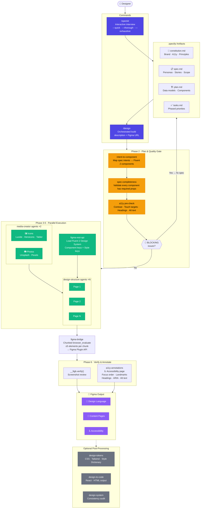

# Figma Plugin — Workflow Infographic

> **One-Pager** · Render with any Mermaid-compatible viewer (GitHub, VS Code Mermaid Preview, Notion, etc.)

---

### Legend

| Color | Meaning |
|-------|---------|
| 🟣 Indigo | Commands (`/speckit`, `/design`) |
| 🟡 Amber | Planning & quality gate skills |
| 🟢 Green | Parallel agents & API skills |
| 🟣 Purple | Figma output pages |
| ⚫ Gray | Optional post-processing |

### Skills (9)

| Skill | Role |
|-------|------|
| `figma-bridge` | Build in Figma via browser — chunked Plugin API calls |
| `figma-rest-api` | Read Fluent 2 Design System — component & style keys |
| `design-tokens` | Extract CSS / Tailwind / Style Dictionary tokens |
| `design-to-code` | Generate React or HTML from Figma designs |
| `design-system` | Audit design consistency across pages |
| `icon-library` | Fetch SVGs from Lucide, Heroicons, Tabler |
| `a11y-annotations` | Pre-check a11y + build annotation overlay page |
| `intent-to-component` | Map spec intents → Fluent 2 component selection |
| `spec-completeness` | Validate component props — BLOCKING / WARNING / INFO |

### Agents (2)

| Agent | Spawned By | Parallelism |
|-------|-----------|-------------|
| `media-creator` | `/design` Phase 3 | 2+ instances (icons, photos) |
| `design-structure` | `/design` Phase 5 | 1 per page (N instances) |

### MCP Server

| Server | Purpose |
|--------|---------|
| `design-playwright` | Browser automation — `npx @playwright/mcp` — drives Figma Plugin API |

---

*figma-plugin v2.2.1 · 9 skills · 2 agents · 2 commands · 1 MCP server*
